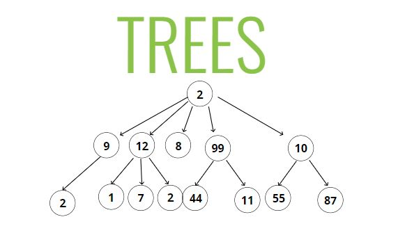

```add(a, b)
return a + b
print(add(1, 2))
```
# Important Links
### For bigO of all type of data
https://www.bigocheatsheet.com/

### Visual of how all sorting works, click on what type of sorting you need
https://visualgo.net/en/sorting

### Classes on MDN
https://developer.mozilla.org/en-US/docs/Web/JavaScript/Reference/Classes

### for the Data Structure like linked list, Stack, Queue etc
https://visualgo.net/en/list?slide=1

### For Link list, stack,que and more on visualgo
https://visualgo.net/en/list?slide=1

### For the trees
https://visualgo.net/en/bst?slide=1


# Trees
###### Tree - A data structure that consists of nodes in a parent / child relationship. There is only one root parent node and then its child below of it


#### List are linear (straight line) while trees are nonlinear


#### Below are the certain which looks like tree but are not


#### TREE TERMINOLOGY
***Root*** - The top node in a tree<br />
***Child*** -A node directly connected to another node when moving away from the Root.<br />
***Parent*** - The converse notion of a child.<br />
***Siblings*** -A group of nodes with the same parent.<br />
***Leaf*** - A node with no children.<br />
***Edge*** - The connection between one node and another.<br />

### KINDS OF TREES
* Trees
* Binary Trees
* Binary Search Trees

### Lots of different applications!

* HTML DOM
* Network Routing
* Abstract Syntax Tree
* Artificial Intelligence
* Folders in Operating Systems
* Computer File Systems

### Binary Tree
A binary tree is a type of data structure, where each node has at most two child nodes, referred to as left child and right child.


### Lots of different applications as well!

* Decision Trees (true / false)
* Database Indicies
* Sorting Algorithms

### BINARY SEARCH TREES

* Every parent node has at most two children
* Every node to the left of a parent node is always less than the parent
* Every node to the right of a parent node is always greater than the parent


