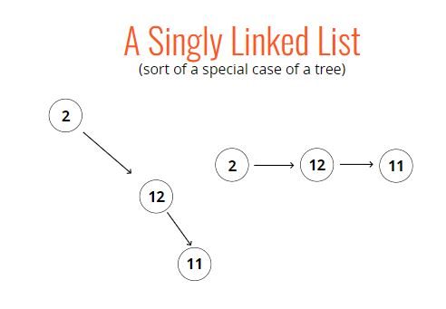

# Important Links

### For bigO of all type of data
https://www.bigocheatsheet.com/

### Visual of how all sorting works, click on what type of sorting you need
https://visualgo.net/en/sorting

### Classes on MDN
https://developer.mozilla.org/en-US/docs/Web/JavaScript/Reference/Classes

### for the Data Structure like linked list, Stack, Queue etc
https://visualgo.net/en/list?slide=1

### For Link list, stack,que and more on visualgo
https://visualgo.net/en/list?slide=1

### For the trees
https://visualgo.net/en/bst?slide=1


# Trees
###### Tree - A data structure that consists of nodes in a parent / child relationship. There is only one root parent node and then its child below of it


#### List are linear (straight line) while trees are nonlinear


#### Below are the certain which looks like tree but are not


#### TREE TERMINOLOGY
***Root*** - The top node in a tree<br />
***Child*** -A node directly connected to another node when moving away from the Root.<br />
***Parent*** - The converse notion of a child.<br />
***Siblings*** -A group of nodes with the same parent.<br />
***Leaf*** - A node with no children.<br />
***Edge*** - The connection between one node and another.<br />

### KINDS OF TREES
* Trees
* Binary Trees
* Binary Search Trees

### Lots of different applications!

* HTML DOM
* Network Routing
* Abstract Syntax Tree
* Artificial Intelligence
* Folders in Operating Systems
* Computer File Systems

### Binary Tree
A binary tree is a type of data structure, ***where each node has at most two child nodes***, referred to as left child and right child.


### Lots of different applications as well!

* Decision Trees (true / false)
* Database Indicies
* Sorting Algorithms

### BINARY SEARCH TREES

* Every parent node has at most two children
* ***Every node to the left of a parent node is always less than the parent***
* ***Every node to the right of a parent node is always greater than the parent***


.png)


### TREE TRAVERSAL - Visiting every node once

There are two Methods
* Breadth-first Search
* Depth-first Search


### Types of DFS


```
class Node {
    constructor(value){
        this.value = value;
        this.left = null;
        this.right = null;
    }
}

class BinarySearchTree {
    constructor(){
        this.root = null;
    }
    insert(value){
        var newNode = new Node(value);
        if(this.root === null){
            this.root = newNode;
            return this;
        }
        var current = this.root;
        while(true){
            if(value === current.value) return undefined;
            if(value < current.value){
                if(current.left === null){
                    current.left = newNode;
                    return this;
                }
                current = current.left;
            } else {
                if(current.right === null){
                    current.right = newNode;
                    return this;
                } 
                current = current.right;
            }
        }
    }
    find(value){
        if(this.root === null) return false;
        var current = this.root,
            found = false;
        while(current && !found){
            if(value < current.value){
                current = current.left;
            } else if(value > current.value){
                current = current.right;
            } else {
                found = true;
            }
        }
        if(!found) return undefined;
        return current;
    }
    contains(value){
        if(this.root === null) return false;
        var current = this.root,
            found = false;
        while(current && !found){
            if(value < current.value){
                current = current.left;
            } else if(value > current.value){
                current = current.right;
            } else {
                return true;
            }
        }
        return false;
    }
    BFS(){
        var node = this.root,
            data = [],
            queue = [];
        queue.push(node);

        while(queue.length){
           node = queue.shift();
           data.push(node.value);
           if(node.left) queue.push(node.left);
           if(node.right) queue.push(node.right);
        }
        return data;
    }
    DFSPreOrder(){
        var data = [];
        function traverse(node){
            data.push(node.value);
            if(node.left) traverse(node.left);
            if(node.right) traverse(node.right);
        }
        traverse(this.root);
        return data;
    }
    DFSPostOrder(){
        var data = [];
        function traverse(node){
            if(node.left) traverse(node.left);
            if(node.right) traverse(node.right);
            data.push(node.value);
        }
        traverse(this.root);
        return data;
    }
    DFSInOrder(){
        var data = [];
        function traverse(node){
            if(node.left) traverse(node.left);
            data.push(node.value);
            if(node.right) traverse(node.right);
        }
        traverse(this.root);
        return data;
    }
}


var tree = new BinarySearchTree();
tree.insert(10);
tree.insert(6);
tree.insert(15);
tree.insert(3);
tree.insert(8);
tree.insert(20);
tree.DFSPreOrder();
tree.DFSPostOrder();
tree.DFSInOrder();
```


#### BFS Vs DFS
* Time complexity of both are same because we are visiting every node once. We can find out on the basis of the space complexity
* Below one depth is winner beacuse we store the data for breath then it will occupy more space

* below is breath winner becase breath store unit value at certain time


* DFS-Inorder gives data in increasing order
* DFS-Preorder gives which we can store and again can make the tree