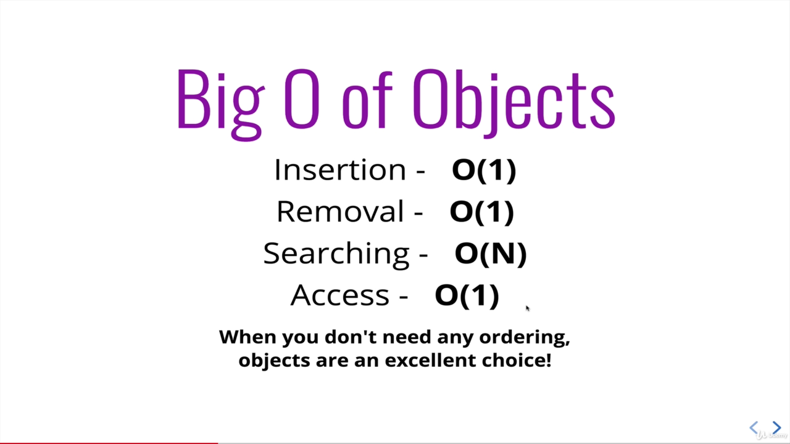

```add(a, b)
return a + b
print(add(1, 2))
```
# Important Links
### For bigO of all type of data
https://www.bigocheatsheet.com/

### Visual of how all sorting works, click on what type of sorting you need
https://visualgo.net/en/sorting

### Classes on MDN
https://developer.mozilla.org/en-US/docs/Web/JavaScript/Reference/Classes

### for the Data Structure like linked list, Stack, Queue etc
https://visualgo.net/en/list?slide=1

### For Link list, stack,que and more on visualgo
https://visualgo.net/en/list?slide=1